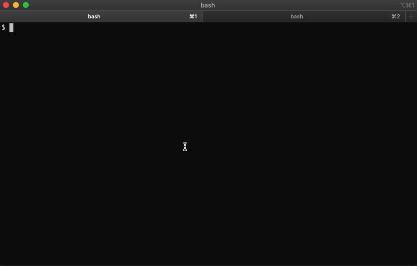

[](https://github.com/batchcorp/plumber/actions/workflows/master-test.yaml) [](https://goreportcard.com/report/github.com/batchcorp/plumber) [](https://launchpass.com/streamdal)

plumber is a CLI devtool for inspecting, piping, messaging and redirecting data
in message systems like Kafka, RabbitMQ , GCP PubSub and 
[many more](#supported-messaging-systems). \[1]

The tool enables you to:

* Safely view the contents of your data streams
* Write plain or encoded data to any system
* Route data from one place to another
* Decode protobuf/avro/thrift/JSON data in real-time
  * Support for both Deep and Shallow protobuf envelope types
  * Support for google.protobuf.Any fields
* Relay data to the [Streamdal platform](https://streamdal.com)
* Ship change data capture events to [Streamdal platform](https://streamdal.com)
* [Replay events into a message system on your local network](https://docs.streamdal.com/what-are/what-are-destinations/plumber-as-a-destination)
* And _many_ other features (for a full list: `plumber -h`)

<sub>\[1] It's like `curl` for messaging systems.</sub>

## Why do you need it?

Messaging systems are black boxes - gaining visibility into what is passing
through them is an involved process that requires you to write brittle consumer
code that you will eventually throw away.

`plumber` enables you to stop wasting time writing throw-away code - use it to
look into your queues and data streams, use it to connect disparate systems 
together or use it for debugging your event driven systems.

## Demo



## Install

### Via brew

```bash
$ brew tap batchcorp/public
$ brew install plumber
```

### Manually

* [macOS](https://github.com/batchcorp/plumber/releases/latest/download/plumber-darwin)
* [Linux](https://github.com/batchcorp/plumber/releases/latest/download/plumber-linux)
* [Windows](https://github.com/batchcorp/plumber/releases/latest/download/plumber-windows.exe)

Plumber is a single binary, to install you simply need to download it, give it executable
permissions and call it from your shell. Here's an example set of commands to do this:

```bash
$ curl -L -o plumber https://github.com/batchcorp/plumber/releases/latest/download/plumber-darwin
$ chmod +x plumber
$ mv plumber /usr/local/bin/plumber
```

## Usage

### Write messages

```bash
❯ plumber write kafka --topics test --input foo
INFO[0000] Successfully wrote message to topic 'test'    backend=kafka
INFO[0000] Successfully wrote '1' message(s)             pkg=plumber
```

### Read message(s)

```bash
❯ plumber read kafka --topics test
INFO[0000] Initializing (could take a minute or two) ...  backend=kafka

------------- [Count: 1 Received at: 2021-11-30T12:51:32-08:00] -------------------

+----------------------+------------------------------------------+
| Key                  |                                     NONE |
| topic                |                                     test |
| Offset               |                                        8 |
| Partition            |                                        0 |
| Header(s)            |                                     NONE |
+----------------------+------------------------------------------+

foo
```

NOTE: Add `-f` to perform a continuous read (like `tail -f`)

### Write messages via pipe

**Write multiple messages**

NOTE: Multiple messages are separated by a newline.

```bash
$ cat mydata.txt
line1
line2
line3

$ cat mydata.txt | plumber write kafka --topics foo

INFO[0000] Successfully wrote message to topic 'foo'  pkg=kafka/write.go
INFO[0000] Successfully wrote message to topic 'foo'  pkg=kafka/write.go
INFO[0000] Successfully wrote message to topic 'foo'  pkg=kafka/write.go
```

**Write each element of a JSON array as a message**

```bash
$ cat mydata.json
[{"key": "value1"},{"key": "value2"}]

$ cat mydata.json | plumber write kafka --topics foo --json-array

INFO[0000] Successfully wrote message to topic 'foo'  pkg=kafka/write.go
INFO[0000] Successfully wrote message to topic 'foo'  pkg=kafka/write.go
```

## Documentation

* [docs/examples.md](https://github.com/batchcorp/plumber/blob/master/docs/examples.md) for more usage examples
* [docs/env.md](https://github.com/batchcorp/plumber/blob/master/docs/env.md) for list of supported environment variables
* [docs/metrics.md](https://github.com/batchcorp/plumber/blob/master/docs/metrics.md) for information on metrics that plumber exposes
* [docs/server.md](https://github.com/batchcorp/plumber/blob/master/docs/server.md) for examples on running plumber in server mode

## Getting Help

A full list of available flags can be displayed by using the `--help` flag after
different parts of the command:

```bash
$ plumber --help
$ plumber read --help
$ plumber read kafka --help
```

## Features

* Encode & decode for multiple formats
  * Protobuf (Deep and [Shallow envelope](https://www.confluent.io/blog/spring-kafka-protobuf-part-1-event-data-modeling/#shallow-envelope))
  * Avro
  * Thrift
  * Flatbuffer
  * GZip
  * JSON
  * JSONPB (protobuf serialized as JSON)
  * Base64
* `--continuous` support (ie. `tail -f`)
* Support for **most** messaging systems
* Supports writing via string, file or pipe
* Observe, relay and archive messaging data
* Single-binary, zero-config, easy-install

## Hmm, what is this Streamdal thing?

We are distributed system enthusiasts that started a company called
[Streamdal](https://streamdal.com). 

Our company focuses on solving data stream observability for complex systems
and workflows. Our goal is to allow _everyone_ to build asynchronous systems,
without the fear of introducing too much complexity.

While working on our company, we built a tool for reading and writing messages
from our messaging systems and realized that there is a serious lack of tooling
in this space.

We wanted a swiss army knife type of tool for working with messaging systems
(we use Kafka and RabbitMQ internally), so we created `plumber`.

## Why the name `plumber`?

We consider ourselves "internet plumbers" of sort - so the name seemed to fit :)

## Supported Messaging Systems

* Kafka
* RabbitMQ
* RabbitMQ Streams 
* Google Cloud Platform PubSub
* MQTT
* Amazon Kinesis Streams 
* Amazon SQS
* Amazon SNS (Publishing)
* ActiveMQ (STOMP protocol)
* Azure Service Bus
* Azure Event Hub
* NATS
* NATS Streaming (Jetstream) 
* Redis-PubSub
* Redis-Streams
* Postgres CDC (Change Data Capture)
* MongoDB CDC (Change Data Capture)
* Apache Pulsar
* NSQ
* KubeMQ
* Memphis - **NEW!**

NOTE: If your messaging tech is not supported - submit an issue and we'll do
our best to make it happen!

### Kafka
You need to ensure that you are using the same consumer group on all plumber
instances.

### RabbitMQ
Make sure that all instances of `plumber` are pointed to the same queue.

### Note on boolean flags
In order to flip a boolean flag to `false`, prepend `--no` to the flag.

ie. `--queue-declare` is `true` by default. To make it false, use `--no-queue-declare`.

## Tunnels

`plumber` can now act as a replay destination (tunnel). Tunnel mode allows you to
run an instance of plumber, on your local network, which will then be available
in the Streamdal platform as a _replay destination_.

This mitigates the need make firewall changes to replay messages from a Streamdal
collection back to your message bus.

See https://docs.streamdal.com/what-are/what-are-destinations/plumber-as-a-destination
for full documentation.

## High Performance & High Availability
`plumber` comes with a "server" mode which will cause plumber to operate as a
highly available cluster.

You can read more about "server mode" [here](https://docs.streamdal.com/plumber/server-mode).

Server mode examples can be found in [docs/server.md](https://github.com/batchcorp/plumber/blob/master/docs/server.md)

## Acknowledgments

**Huge** shoutout to [jhump](https://github.com/jhump) and for his excellent
[protoreflect](https://github.com/jhump/protoreflect) library, without which
`plumber` would not be anywhere *near* as easy to implement. _Thank you!_

## Release

To push a new plumber release:

1. `git tag v0.18.0 master`
1. `git push origin v0.18.0`
1. Watch the github action
1. New release should be automatically created under https://github.com/batchcorp/plumber/releases/
1. Update release to include any relevant info
1. Update [homebrew](https://github.com/batchcorp/homebrew-public/blob/master/plumber.rb) SHA and version references

## Contribute

We love contributions! Prior to sending us a PR, open an issue to discuss what
you intend to work on. When ready to open PR - add good tests and let's get this
thing merged! For further guidance check out our [contributing guide](https://github.com/batchcorp/plumber/blob/master/CONTRIBUTING.md).
